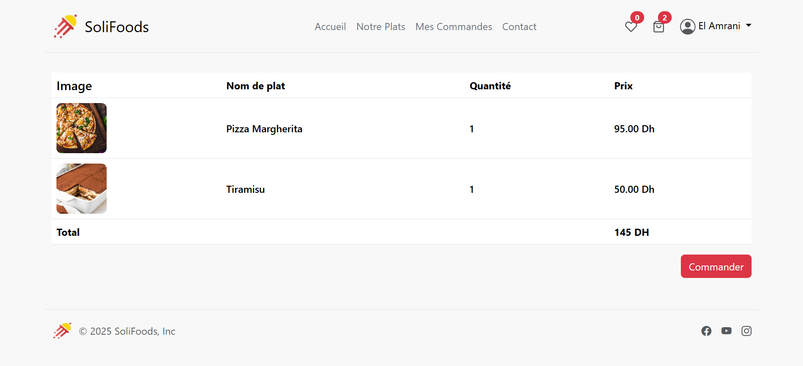

# Food-delivery


Food-delivery est une application web moderne et responsive de commande de plats en ligne.
Elle permet aux clients de parcourir les menus, de passer leurs commandes facilement et aux administrateurs de gérer l’ensemble du système.

Développée en PHP avec Bootstrap et une base de données MySQL.

## Fonctionnalités

👤 Côté client

- Inscription et authentification sécurisées

- Navigation par catégorie et type de cuisine

- Recherche et filtrage des plats

- Ajout au panier et gestion des quantités

- Passage de commande et suivi

- Historique des commandes

🔧 Côté administration

- Tableau de bord complet

- Gestion des plats (ajout, modification, suppression)

- Gestion des commandes (suivi et mise à jour des statuts)

- Gestion des clients

## Prérequis

- Serveur local (MAMP/XAMPP/WAMP)
- PHP >= 7.0
- MySQL

## Installation

1. Clonez le projet :
   ```bash
   git clone https://github.com/Fatima-Zohra-Jaber/Food-delivery.git
   ```
2. Importez la base de données `db.sql` dans MySQL
3. Configurez l'accès à la base dans `config.php`
4. Lancez le serveur local et accédez à `http://localhost/Food-delivery/index.php`

## Captures d'écran

### Partie administration

#### Tableau de bord


#### Gestion des commandes


#### Gestion des plats


#### Gestion des clients


### Partie client

#### Liste des plats


#### Confirmation de commande



#### Historique des commandes


