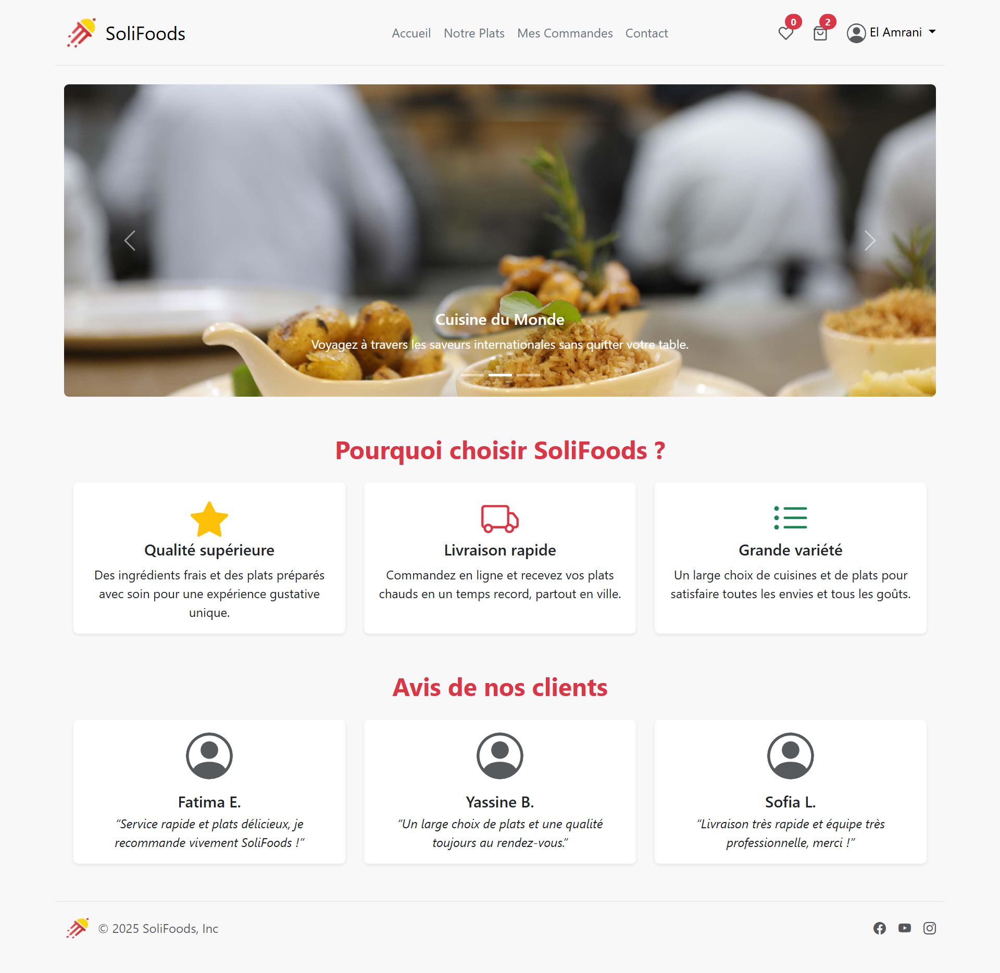
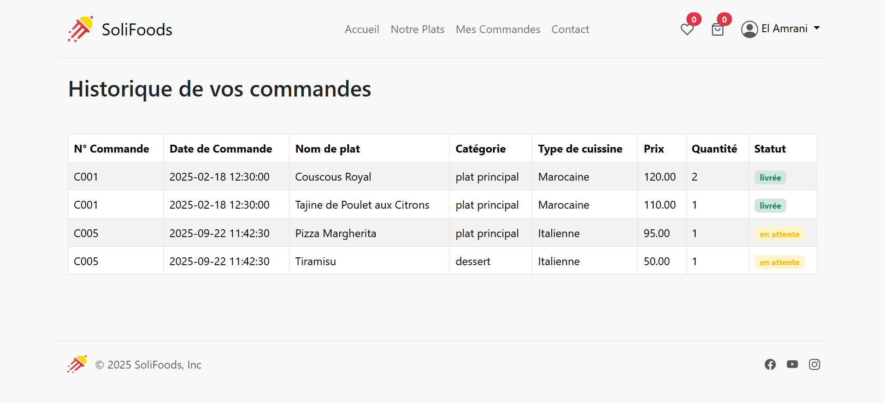

# Food-delivery



Food-delivery est une application web de commande de plats en ligne, moderne et responsive, développée en PHP avec Bootstrap.

## Fonctionnalités

- Authentification et inscription client
- Parcourir les plats par catégorie et type de cuisine
- Recherche et filtrage des plats
- Ajout au panier et gestion des quantités
- Historique des commandes
- Interface d'administration (dashboard ,gestion des commandes ,gestion des plats, gestion des clients )

## Prérequis

- Serveur local (MAMP/XAMPP/WAMP)
- PHP >= 7.0
- MySQL

## Installation

1. Clonez le projet :
   ```bash
   git clone https://github.com/Fatima-Zohra-Jaber/Food-delivery.git
   ```
2. Importez la base de données `db.sql` dans MySQL
3. Configurez l'accès à la base dans `config.php`
4. Lancez le serveur local et accédez à `index.php`

## Captures d'écran

### Partie administration

#### Tableau de bord


#### Gestion des plats


#### Gestion des commandes


#### Gestion des clients


### Partie client

#### Liste des plats


#### Confirmation de commande


#### Historique des commandes


